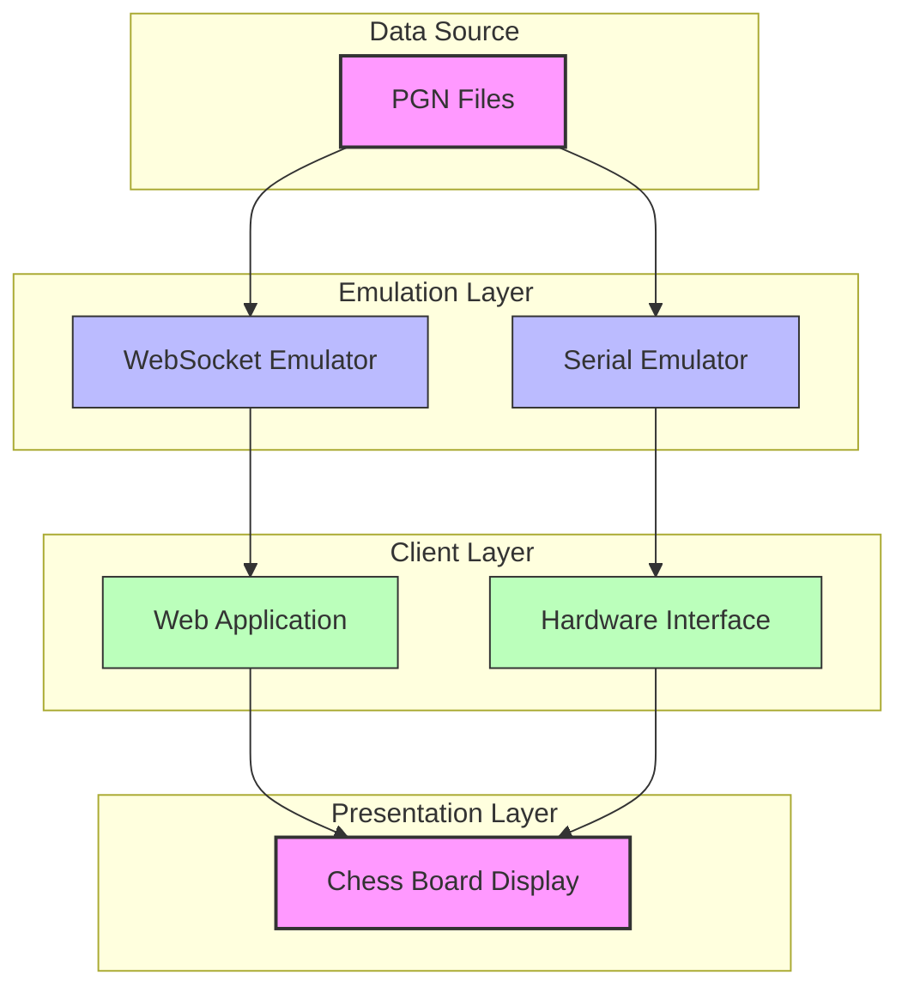
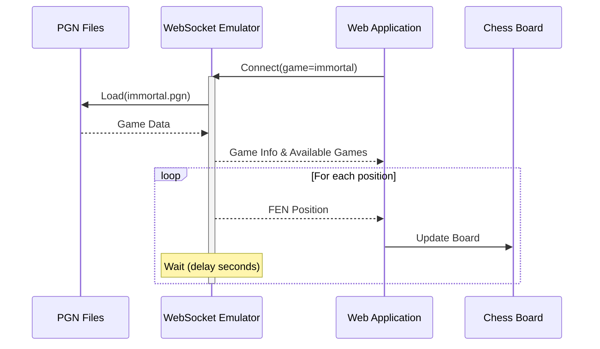
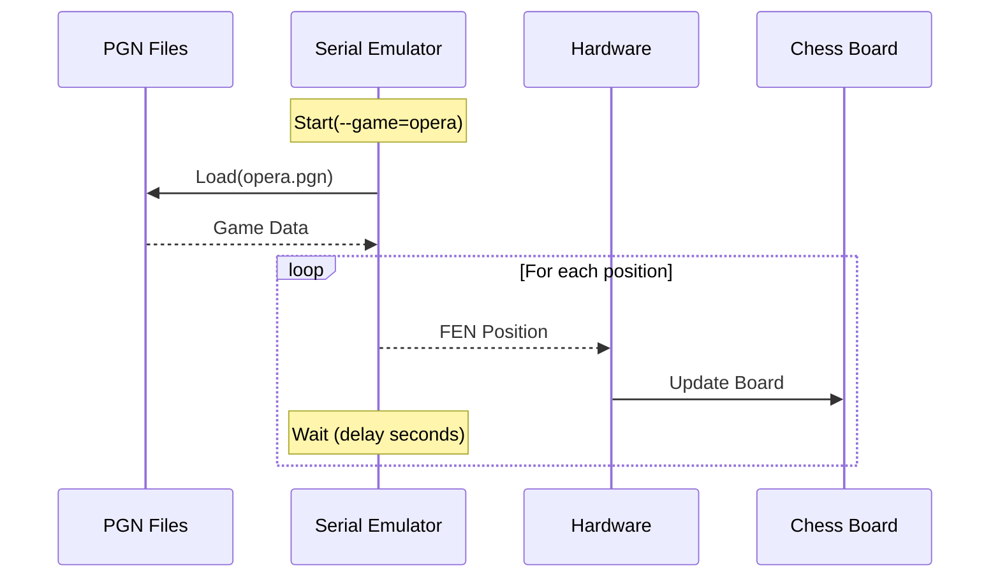
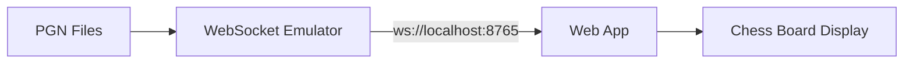
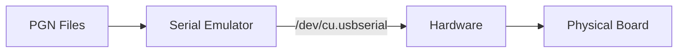
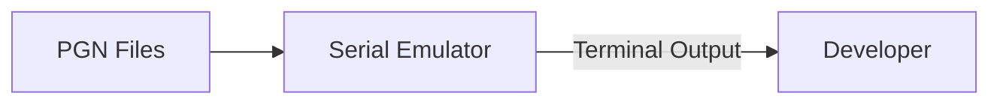
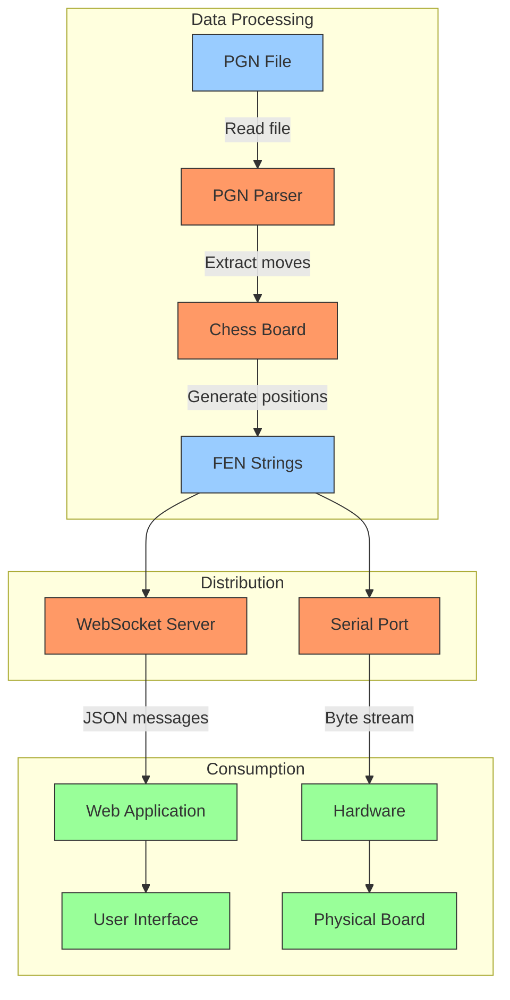

# ChessLink Simulation Architecture

This document describes the architecture of the ChessLink simulation system, which allows for testing and development of the ChessLink application without requiring physical hardware.

## System Overview

The ChessLink system consists of several components that work together to visualize chess games:

1. **PGN Files**: Source of chess games in Portable Game Notation format
2. **Emulation Layer**: Two distinct emulators that process PGN files
   - **WebSocket Emulator**: Sends chess positions to the web application
   - **Serial Emulator**: Sends chess positions through a serial port
3. **Web Application**: React-based frontend that displays the chess board
4. **Hardware**: Physical chess board that connects via serial port (optional)

## Architecture Diagram



## Component Details

### PGN Files
- Located in `hardware/sim/pgn/`
- Contains famous chess games in standard PGN format
- Examples include Anderssen's Immortal Game, Kasparov vs Topalov, etc.
- Serves as the source of chess positions for simulation

### WebSocket Emulator (`pgn_websocket_emulator.py`)
- Reads PGN files and converts them to FEN positions
- Runs a WebSocket server on port 8765
- Streams chess positions to web clients
- Supports game selection via query parameters
- Features loop mode for continuous playback

### Serial Emulator (`pgn_serial_emulator.py`)
- Reads PGN files and converts them to FEN positions
- Sends FEN strings through a serial port
- Can run in simulation mode without hardware
- Supports interactive port selection
- Features loop mode for continuous playback

### Web Application (`Demo.tsx`)
- React-based frontend component
- Connects to WebSocket emulator to receive positions
- Renders chess board based on FEN strings
- Provides UI for selecting games and connection modes
- Displays player indicators and game information

## Communication Flow



## Serial Communication Flow



## Simulation Modes

The ChessLink system supports multiple simulation modes to accommodate different testing scenarios:

### WebSocket Mode (for Web Testing)


### Serial Mode (for Hardware Testing)


### Simulation Mode (No Hardware)


## Usage Example

### Running WebSocket Emulator
```bash
./hardware/sim/start_pgn_websocket.sh --game immortal
```

The script will:
1. Load the "immortal" PGN file
2. Start a WebSocket server on port 8765
3. Stream positions from the game with a delay

### Running Serial Emulator
```bash
./hardware/sim/start_pgn_serial.sh --port /dev/cu.usbserial --game kasparov_topalov
```

The script will:
1. Load the "kasparov_topalov" PGN file
2. Connect to the specified serial port
3. Stream positions from the game with a delay

## Data Flow



## Architecture Benefits

1. **Decoupled Components**: The emulation layer separates the data source from the presentation layer
2. **Multiple Testing Paths**: Allows testing both web and hardware interfaces
3. **Simulation Mode**: Enables development without physical hardware
4. **Standardized Data**: Uses PGN and FEN standards for data interchange
5. **Extensible Design**: New games can be added by simply adding PGN files

## Technical Implementation

Both emulators share similar code structure:
- They parse command-line arguments for configuration
- They load PGN files and convert them to FEN positions
- They implement error handling and graceful shutdown
- They support looping through positions continuously

The main difference is in how they distribute the FEN strings:
- WebSocket Emulator uses async WebSocket connections
- Serial Emulator uses synchronous serial port communication 