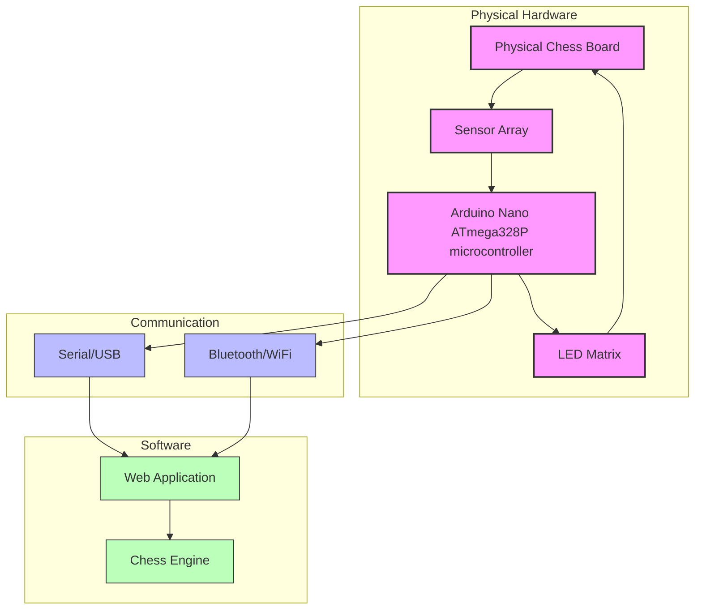
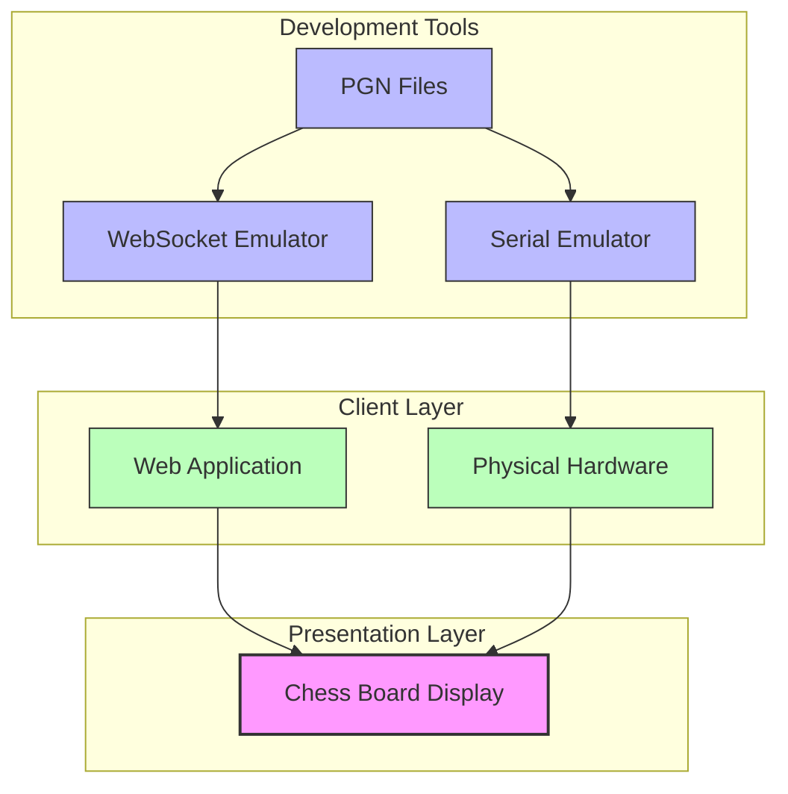
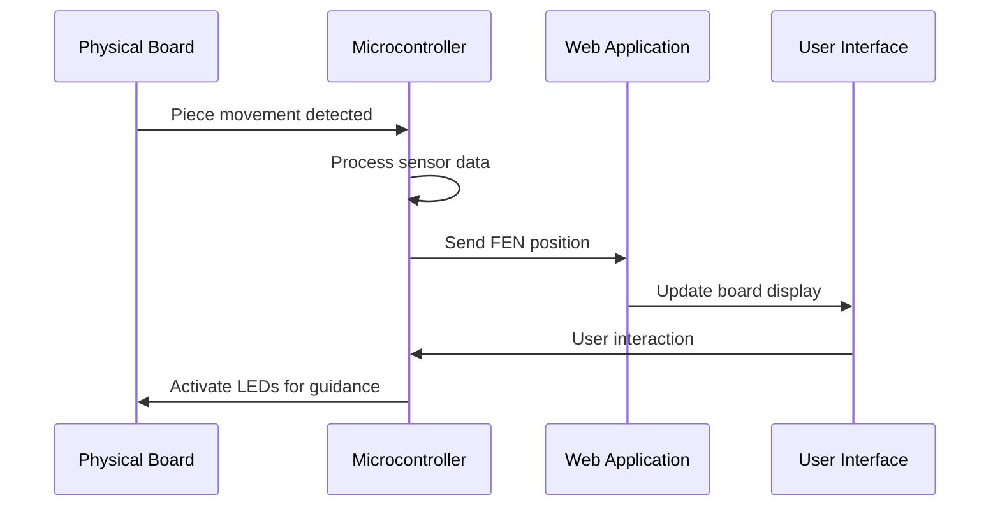
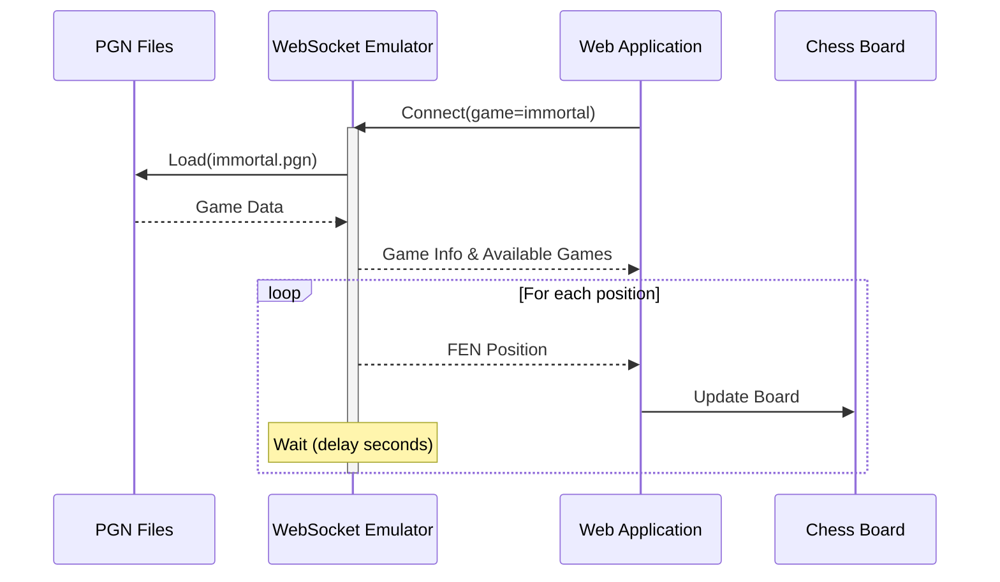
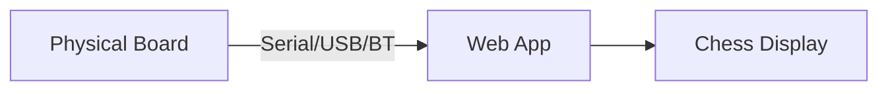
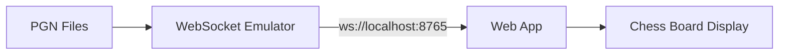
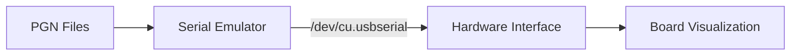
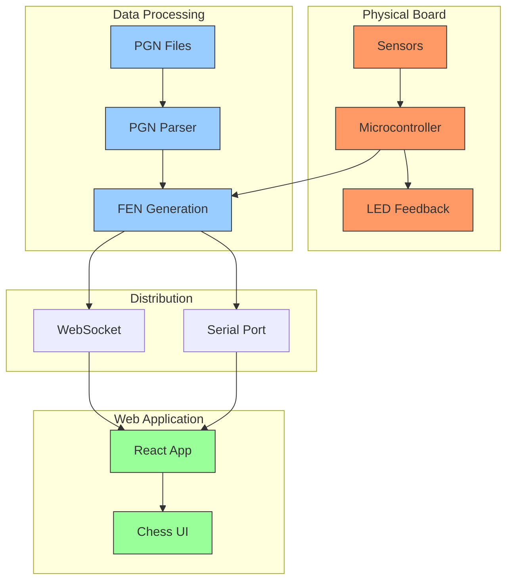

# ChessLink Hardware and Simulation Architecture

This document describes the architecture of the ChessLink system and its simulation components. The ChessLink is primarily a **physical chess board with embedded sensors** that transmit real-time data to a web application, with simulation modes provided for development and testing purposes.

## Primary System Overview

The ChessLink's core purpose is to create a bridge between physical chess play and digital analysis:

1. **Physical Chess Board**: The hardware centerpiece with embedded sensors that detect piece movements
2. **Sensor Array**: 64-square matrix of Hall effect sensors and phototransistors that detect magnetic chess pieces
3. **LED System**: RGB LEDs in each square for visual feedback and move guidance
4. **Microcontroller**: ESP32-C3 with multiple ATtiny microcontrollers for sensor/LED management
5. **Web Application**: React-based frontend that displays the synchronized digital board
6. **Communication Layer**: Serial/USB or Wireless connections between hardware and software

## Physical Hardware Architecture



## Sensor System

The physical board uses two types of sensors to detect chess pieces:

1. **Hall Effect Sensors**: Detect the magnetic field from specially prepared chess pieces
2. **Phototransistors**: Measure light reflectance from the bottom of pieces for identification

These sensors are organized in an 8×8 matrix configuration and managed by multiple microcontrollers.

## Hardware Circuit Design

```
+-----------------+    +-----------------+    +-----------------+
| Sensor Module   |    | Arduino Nano (x16) |    | Arduino     |
| Phototransistor|====> Each Handles 2×2 |====> Main Controller |
| Hall Effect     |    | Grid Section     |    | (UART Master)   |
| IR Emitter      |    | UART to ESP32    |    |                 |
| RGB LEDs        |    | (4 ATtiny in P1) |    |                 |
+-----------------+    +-----------------+    +-----------------+
                                                             
                                               | USB/Bluetooth/WiFi
                                               v
                                        +-----------------+
                                        | Web Application |
                                        | Chess Display   |
                                        | Analysis Tools  |
                                        +-----------------+
```

## Simulation Architecture

For development and testing without physical hardware, the ChessLink system includes simulation components that emulate the physical board's behavior.

### Simulation Components

1. **PGN Files**: Source of chess games used to generate positions
2. **Emulation Layer**:
   - **WebSocket Emulator**: Sends chess positions to the web application via WebSocket
   - **Serial Emulator**: Sends chess positions through a serial port, mimicking the physical board
3. **Web Application**: Connects to either the physical hardware or simulation components



## Communication Flow

### Hardware Communication Flow



### Simulation Communication Flow



## Usage Modes

The ChessLink system supports multiple operating modes:

### Hardware Mode (Primary Use Case)


### WebSocket Simulation Mode (Development Testing)


### Serial Simulation Mode (Hardware Interface Testing)


## Benefits of the Architecture

1. **Real Physical Interaction**: Play chess on a tangible board with automatic digital synchronization
2. **Visual Guidance**: LED system highlights valid moves, checks, and training suggestions
3. **Development Flexibility**: Simulation modes allow development without physical hardware
4. **Multiple Testing Paths**: Test both hardware interfaces and software components separately
5. **Standardized Communication**: Uses FEN notation for consistent data interchange

## Technical Details

### Firmware and Hardware
- ESP32/Arduino code handling sensor data processing and LED control
- Custom PCB integrating sensors, LEDs, and microcontrollers
- Communication via Serial port, Bluetooth, or WiFi

### Software Components
- React-based web application
- WebSocket and Serial APIs for real-time communication
- PGN parsers for chess game simulation

## Data Flow

